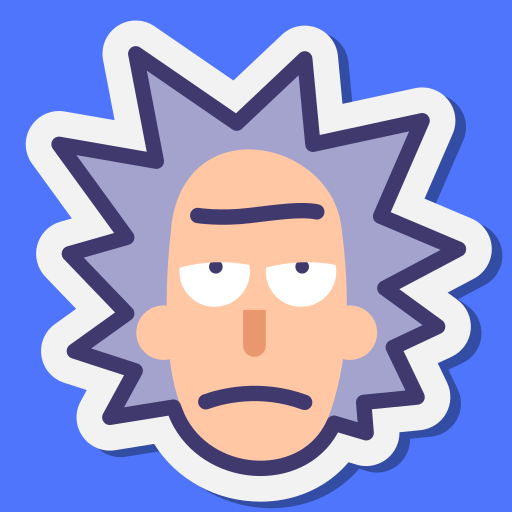
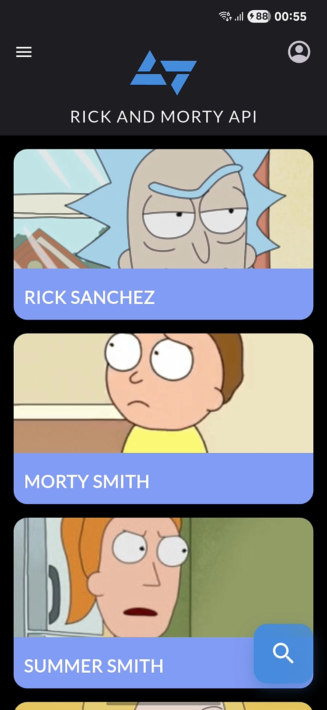
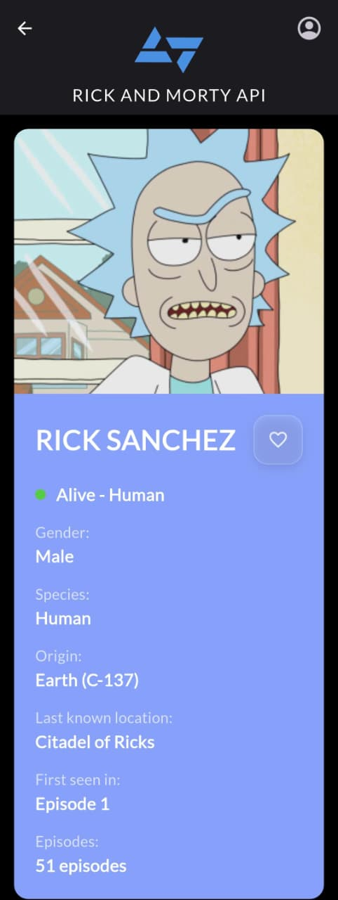
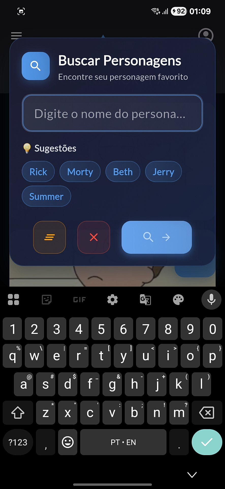

# 🛸 Kobe and Morty - Rick and Morty Character Explorer

<div align="center">
  
  
  [](https://flutter.dev/)
  [](https://dart.dev/)
  [](https://rickandmortyapi.com/)
</div>

---

## 📖 Sobre o Projeto

Aplicativo desenvolvido em Flutter para o desafio técnico da Kobe Apps 2025.

<div align="center">
  
  
  
</div>

---

## 📐 Padrões e Arquitetura

### Estrutura do Projeto:

```
lib/
├── main.dart                        # Ponto de entrada da aplicação
├── core/                           # Configurações centrais
│   ├── theme/
│   │   └── app_theme.dart          # Sistema de cores, tipografia e espaçamentos
│   └── utils/
│       └── page_transitions.dart    # Transições customizadas entre telas
├── data/                           # Camada de dados
│   ├── models/                     # Modelos de dados
│   │   ├── character_model.dart    # Modelo principal do personagem
│   │   ├── origin_model.dart       # Modelo de origem
│   │   ├── location_model.dart     # Modelo de localização
│   │   └── api_response_model.dart # Wrapper de resposta da API
│   └── services/                   # Serviços de dados
│       ├── rick_and_morty_api_service.dart # Cliente HTTP da API
│       ├── favorites_service.dart   # Gerenciamento de favoritos
│       └── local_auth_service.dart  # Autenticação local
└── presentation/                   # Interface do usuário
    ├── pages/                      # Telas principais
    │   ├── home_page.dart          # Lista de personagens
    │   ├── character_detail_page.dart # Detalhes do personagem
    │   ├── favorites_page.dart     # Lista de favoritos
    │   └── profile_page.dart       # Perfil do usuário
    └── widgets/                    # Componentes reutilizáveis
        ├── character_card.dart     # Card do personagem
        ├── characters_list.dart    # Lista com scroll infinito
        ├── custom_app_bar.dart     # AppBar customizada
        ├── search_dialog.dart      # Modal de busca
        ├── filters_drawer.dart     # Drawer de filtros
        ├── empty_state_widget.dart # Estados vazios
        ├── dialogs/               # Modais diversos
        │   ├── login_dialog.dart   # Modal de login
        │   ├── signup_dialog.dart  # Modal de cadastro
        │   └── edit_profile_dialog.dart # Modal de edição
        └── profile/               # Componentes do perfil
            ├── profile_header.dart # Header do perfil
            └── settings_tab.dart   # Aba de configurações
```

### Arquitetura utilizada:

**Padrões adotados:**

- **Singleton Pattern** para gerenciamento de serviços únicos
- **Repository Pattern** para abstração de dados
- **Factory Pattern** para construção de modelos a partir de JSON
- **Observer Pattern** para gerenciamento de estado com setState
- Uso de constantes e temas centralizados para consistência visual

---

## 🛠 Tecnologias Utilizadas

- **Flutter** — Framework de desenvolvimento multiplataforma
- **HTTP** — Cliente REST para consumo da API
- **SharedPreferences** — Persistência local de dados
- **CachedNetworkImage** — Cache inteligente de imagens
- **Google Fonts** — Tipografia Lato personalizada
- **Rick and Morty API** — Fonte de dados dos personagens

---

## 📱 Funcionalidades

### ✅ Obrigatórias (Requisitos de entrega)

#### **Listagem de personagens**

Exibe personagens da API Rick and Morty em grid responsivo com scroll infinito.

- Grid layout adaptativo
- Scroll infinito com lazy loading
- Pull to refresh
- Loading states com indicadores visuais
- Tratamento de erros com retry

<div align="center">
  
</div>

#### **Tela de detalhes do personagem**

Navegação da listagem para detalhes completos do personagem.

- Informações detalhadas: nome, status, espécie, gênero, localização
- Hero animation na imagem
- Botão de favoritar com feedback visual
- AppBar transparente com gradiente

<div align="center">
  
</div>

#### **Pesquisa de personagens**

Sistema de busca avançado com UX otimizada.

- Campo de busca com debounce
- Modal de busca com animações
- Sugestões de personagens populares
- Busca em tempo real

<div align="center">
  
</div>

#### **Utilização da versão REST da API**

Consumo completo da Rick and Morty API com otimizações.

- Timeout configurável e retry automático
- Cache de requisições
- Paginação eficiente
- Filtros por parâmetros da API

---

### 💡 Opcionais (Extras desenvolvidos)

#### **Filtros avançados**

Sistema completo de filtros combinados.

- Filtros por status (Alive/Dead/Unknown)
- Filtros por gênero (Male/Female/Genderless/Unknown)
- Filtros por espécie (Human/Alien/Robot/Animal/etc.)
- Drawer lateral com design moderno
- Contador de filtros ativos
- Resumo visual dos filtros aplicados

<div align="center">
  
</div>

#### **Sistema de favoritos**

Gerenciamento completo de personagens favoritos.

- Marcar/desmarcar personagens como favoritos
- Persistência local com SharedPreferences
- Página dedicada aos favoritos
- Swipe to delete nos favoritos
- Ação "desfazer" ao remover favoritos
- Sincronização entre todas as telas

<div align="center">
  
</div>

#### **Sistema de perfil do usuário**

Autenticação local com perfil completo.

- Login/cadastro com validação de formulários
- Perfil do usuário com header personalizado
- TabView: Favoritos + Configurações
- Edição de perfil
- Gerenciamento de conta
- About dialog com informações do desenvolvedor

<div align="center">
  
</div>

#### **Tema Dark personalizado**

Interface moderna inspirada no universo Rick and Morty.

- Paleta de cores temática
- Gradientes espaciais
- Animações e transições suaves
- Material Design 3
- Componentes customizados

---

## 🎨 Sistema de Design

### Paleta de cores:

- **Azul Rick**: `#4A90E2` - Cor principal
- **Verde Portal**: `#00D4AA` - Acentos
- **Background**: `#1A1A1A` - Fundo escuro
- **Surface**: `#2D2D2D` - Cards e componentes

### Componentes principais:

- **CharacterCard**: Card do personagem com gradiente
- **CustomAppBar**: AppBar com scroll effects
- **SearchDialog**: Modal de busca animado
- **FiltersDrawer**: Drawer de filtros moderno

---

## ⚡ Otimizações Implementadas

### Performance:

- **Network**: Timeout, retry, cache de imagens
- **Memory**: Dispose controllers, lazy loading
- **UI**: Scroll infinito otimizado, animações eficientes

### UX/UI:

- **Loading States**: Indicadores em todas operações assíncronas
- **Error Handling**: Tratamento completo com feedback ao usuário
- **Empty States**: Orientação quando não há dados
- **Responsive**: Design adaptativo para diferentes telas

---

## 🚀 Como rodar o projeto

### Clonar repositório

```bash
git clone https://github.com/kevyncode/kobe-challenge-kevyncode.git
cd kobe-challenge-kevyncode
```

### Instalar dependências

```bash
flutter pub get
```

### Rodar

```bash
flutter run
```

### Build para produção

```bash
# Android
flutter build apk --release

# iOS (Mac apenas)
flutter build ios --release
```

---

## 👨‍💻 Desenvolvedor

<div align="center">
  
  
  **Kevyn Rodrigues**  
  *Full-Stack Developer*
  
  [](https://github.com/kevyncode)
  [](https://www.linkedin.com/in/kevyncode/)
  [](mailto:kevyncodes@gmail.com)
</div>

---

<div align="center">
  
**🛸 Desenvolvido para explorar o multiverso Rick and Morty 🛸**

_"Wubba Lubba Dub Dub!" - Rick Sanchez_

</div>
